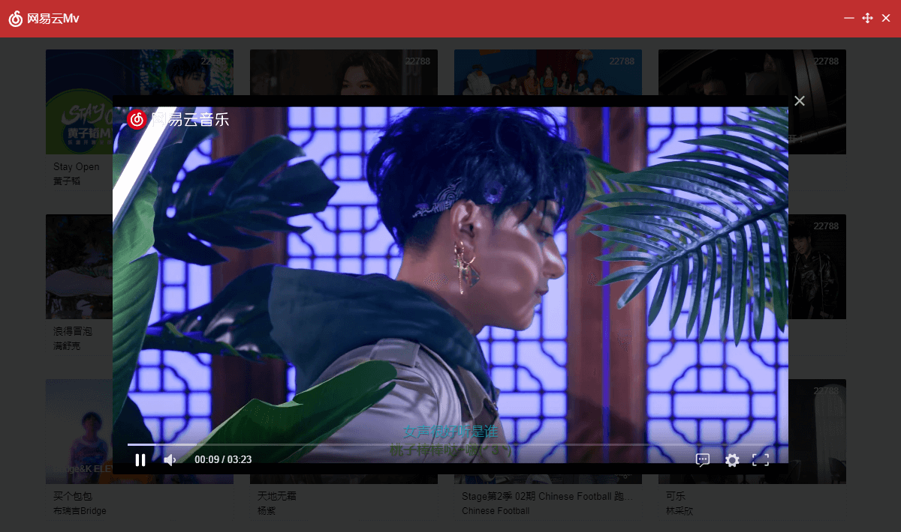

# 网易云Mv

> An electron-vue project

# 文章地址

[掘金](https://juejin.im/post/5bb3b193e51d450e8377a134)

[blog](https://xiaotiandada.github.io/2018/10/03/electron-vu%E6%89%93%E9%80%A0%E4%BD%8E%E9%85%8D%E7%89%88%E7%BD%91%E6%98%93%E4%BA%91-Mv%E7%89%88/)


# 界面截图




#### Build Setup

``` bash
# install dependencies
npm install

# serve with hot reload at localhost:9080
npm run dev

# build electron application for production
npm run build

# run unit & end-to-end tests
npm test


# lint all JS/Vue component files in `src/`
npm run lint

```

---

This project was generated with [electron-vue](https://github.com/SimulatedGREG/electron-vue)@[4c6ee7b](https://github.com/SimulatedGREG/electron-vue/tree/4c6ee7bf4f9b4aa647a22ec1c1ca29c2e59c3645) using [vue-cli](https://github.com/vuejs/vue-cli). Documentation about the original structure can be found [here](https://simulatedgreg.gitbooks.io/electron-vue/content/index.html).
